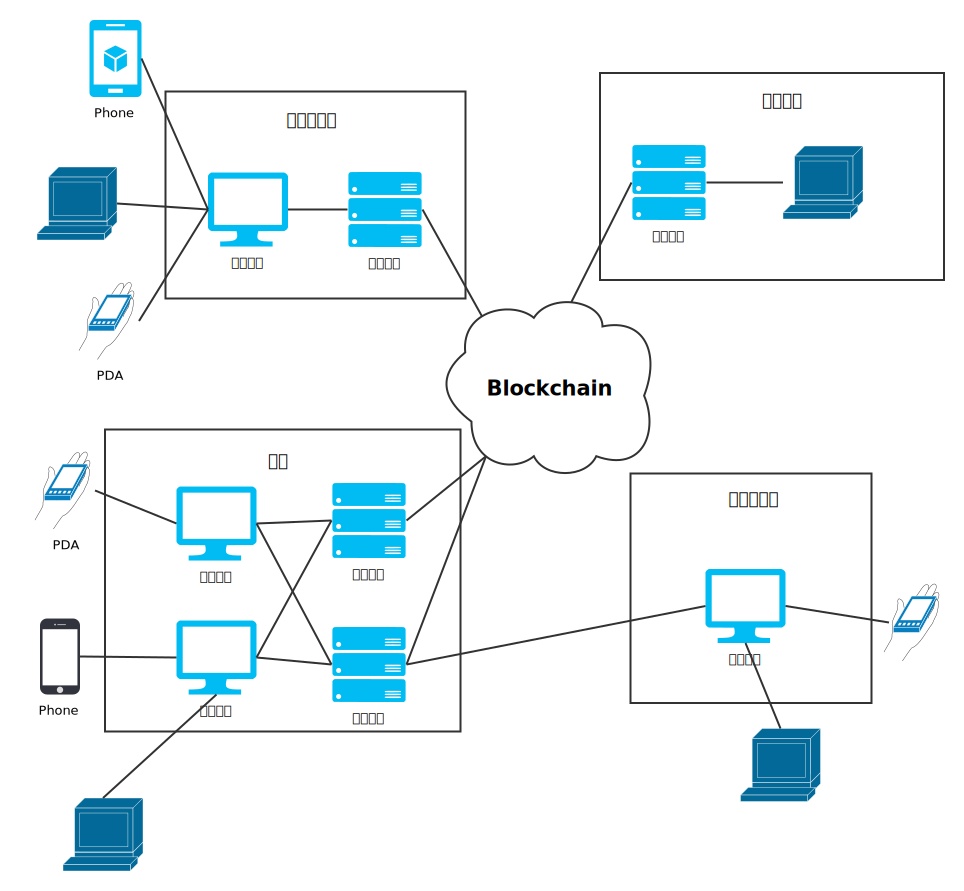

# 永辉食品链架构设计

## 时间表

### 与云网对接计划

> 争取每1~2周对接一种商品

| 工作内容                          | 开始时间     | 结束时间   | 负责人    |
| ----------------------------- | ---------- | --------- | -------- |
| 兴城多宝鱼业务对接  | 2018年07月09日    | 2018年07月20日 | 李亚科  |
| 彩食鲜豆制品业务对接  | 2018年07月13日    | 2018年07月27日 | 李亚科 |

### 永辉食品链开发计划

| 工作内容                          | 开始时间       | 结束时间     | 负责人 |
| ----------------------------- | ------------ | ----------- | ------- |
| 多宝鱼智能合约完善  | 2018年07月13日   | 2018年07月18日 | 黄强 |
| 后端接口完善（改为通用后端） | 2018年07月13日  | 2018年07月18日 | 凡羊羊 |
| 后端+智能合约联调 | 2018年07月18日 | 2018年07月20日 | 黄强、凡羊羊 |
| Fabric 环境搭建与测试 | 2018年07月13日 | 2018年07月17日 | 徐正平 |
| 后端编译为 docker 镜像 | 2018年07月17日 | 2018年07月20日 | 徐正平 |
| 后端+智能合约性能测试 | 2018年07月18日 | 2018年07月20日 | 徐正平 |
| 食品溯源管理系统架构设计 | 2018年07月13日 | 2018年07月20日 | 李亚科 |

## 网络架构图

## 服务于业务的后端

- 养殖场
- 农场

## 智能合约

- 订单管理
- 组织管理
- 对应各SKU的合约

## 永辉食品溯源后台管理系统

- 